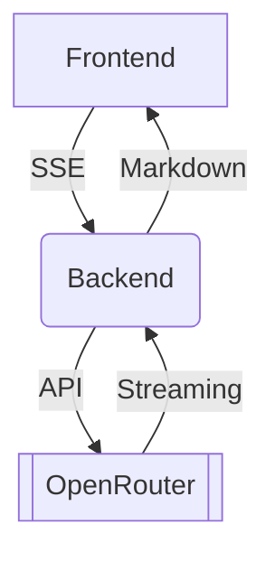

# 🚀 AI-Powered Content & Email Generator

<div align="center">


**Next-Gen AI Content Generation Platform**

</div>

<br/>

<div align="center">
  <video 
    src="https://github.com/SarraBenAmmar/AI-Email-Message-Generator/raw/main/Enregistrement%202025-11-30%20173043.mp4"
    width="750"
    controls
  ></video>
</div>

## 📋 Table of Contents
- [🌟 Overview](#-overview)
- [✨ Features](#-features)
- [📁 Project Structure](#-project-structure)
- [🚀 Installation](#-installation)
- [⚙️ Configuration](#️-configuration)
- [💡 Usage](#-usage)
- [🔌 API Documentation](#-api-documentation)
- [🛠 Development](#-development)
- [🐛 Troubleshooting](#-troubleshooting)
- [🤝 Contributing](#-contributing)
- [📄 License](#-license)

## 🌟 Overview
Modern web platform leveraging **OpenRouter AI** with Mistral models to generate:
- 📧 Professional emails
- 📱 Social media content
- 🎬 Video scripts
- 💡 Creative ideas

```text
Core Stack:
◼ Frontend: React 18+ with Vite
◼ Backend: FastAPI + Python 3.10+
◼ Styling: CSS Modules + Neon UI
```

## ✨ Features
### 🎯 Core Capabilities
| Category | Description | Use Cases |
|----------|-------------|-----------|
| 📧 Email | Business communications | Client outreach |
| 📱 Social Media | Platform-specific posts | Campaign management |
| 🎬 Video Scripts | YouTube/Tutorials | Video production |
| 💡 Ideas | Brainstorming | Content strategy |

### ⚡ Technical Highlights
```text
✔ Real-time generation
✔ SSE Streaming
✔ 5+ AI model support
✔ Responsive UI
✔ Advanced error handling
```

## 📁 Project Structure
```text
ai-email-generator/
├── frontend/
│   ├── src/
│   │   ├── assets/       # Icons & logos
│   │   ├── components/   # React components
│   │   └── styles/       # CSS themes
│   └── vite.config.js
│
├── backend/
│   ├── core/             # Business logic
│   ├── models/           # Pydantic models
│   └── main.py           # Entry point
│
└── docs/                 # Technical documentation
```

## 🚀 Installation
### Prerequisites
- Node.js 18+
- Python 3.10+
- OpenRouter account

### Backend Setup
```bash
cd backend
python -m venv .venv
source .venv/bin/activate  # Linux/Mac
pip install -r requirements.txt
```

### Frontend Setup
```bash
cd frontend
npm install
npm run dev
```

## ⚙️ Configuration
`.env` (Backend):
```env
"""
Configuration settings for the AI Content Generator
"""
from typing import List
from models.schemas import Tone, Audience, Channel

# OpenRouter Configuration
OPENROUTER_API_URL = "https://openrouter.ai/api/v1/chat/completions"
OPENROUTER_API_KEY = "API-KEY"  # Replace with your key
OPENROUTER_MODEL = "mistralai/mistral-7b-instruct"

# Available Content Types from Channel Enum
CHANNELS: List[str] = [channel.value for channel in Channel]

# Available Tones from Tone Enum
TONES: List[str] = [tone.value for tone in Tone]

# Available Audiences from Audience Enum
AUDIENCES: List[str] = [audience.value for audience in Audience]

# Export Formats
EXPORT_FORMATS: List[str] = ["csv", "txt"]
```

## 💡 Usage
1. Navigate to `http://localhost:3000`
2. Select content type
3. Configure parameters:
   ```text
   - Primary topic
   - Tone (Professional/Creative)
   - Keywords
   - Desired length
   ```
4. Instant generation with live preview

## 🔌 API Documentation
### Content Generation
```http
POST /api/v1/generate
Content-Type: application/json

{
  "content_type": "email",
  "language": "en",
  "parameters": {
    "recipient": "Client XYZ",
    "key_points": ["Follow-up", "Oct 25 meeting"]
  }
}
```

Response:
```json
{
  "content": "Dear [Name], ...",
  "tokens_used": 142,
  "generation_time": 1.45
}
```

## 🛠 Development
### Essential Commands
| Action | Command |
|--------|---------|
| Start backend | `uvicorn main:app --reload` |
| Build frontend | `npm run build` |
| Run tests | `pytest -v` |

### Technical Architecture


## 🐛 Troubleshooting
Common Issues:
1. CORS Errors:
   ```bash
   # backend/main.py
   app.add_middleware(
       CORSMiddleware,
       allow_origins=["*"]
   )
   ```
2. Invalid API Key:
   ```text
   Verify credits at openrouter.ai
   ```

## 🤝 Contributing
Recommended Workflow:
1. Create branch: `feat/new-feature`
2. Follow standards:
   ```text
   ◼ Python: Black + Flake8
   ◼ JS: ESLint + Prettier
   ```
3. Add tests for new features

## 📄 License
MIT License - [View Full License](LICENSE)

<div align="center">
<br/>
📧 Contact: sarrahhbam@gmail.com<br/>
⭐ Star this repo if you find it useful!
</div>
